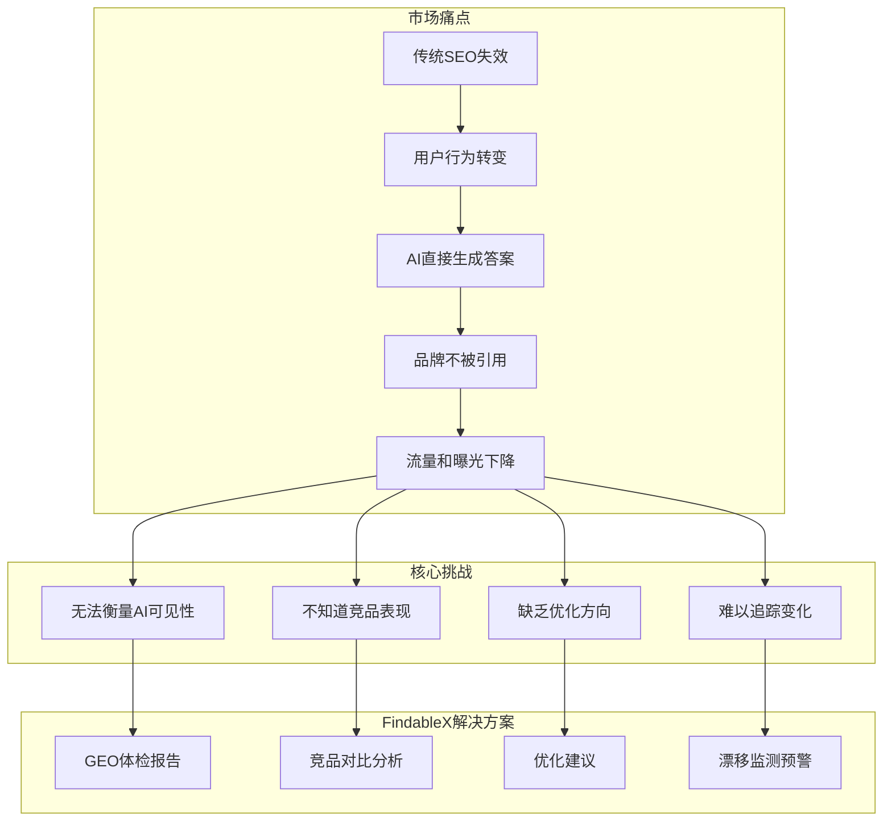
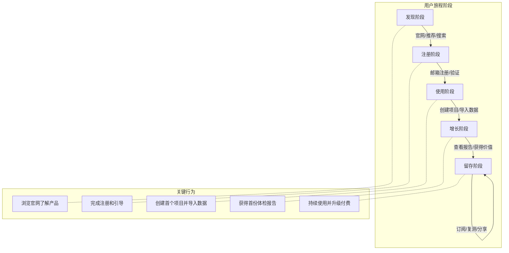
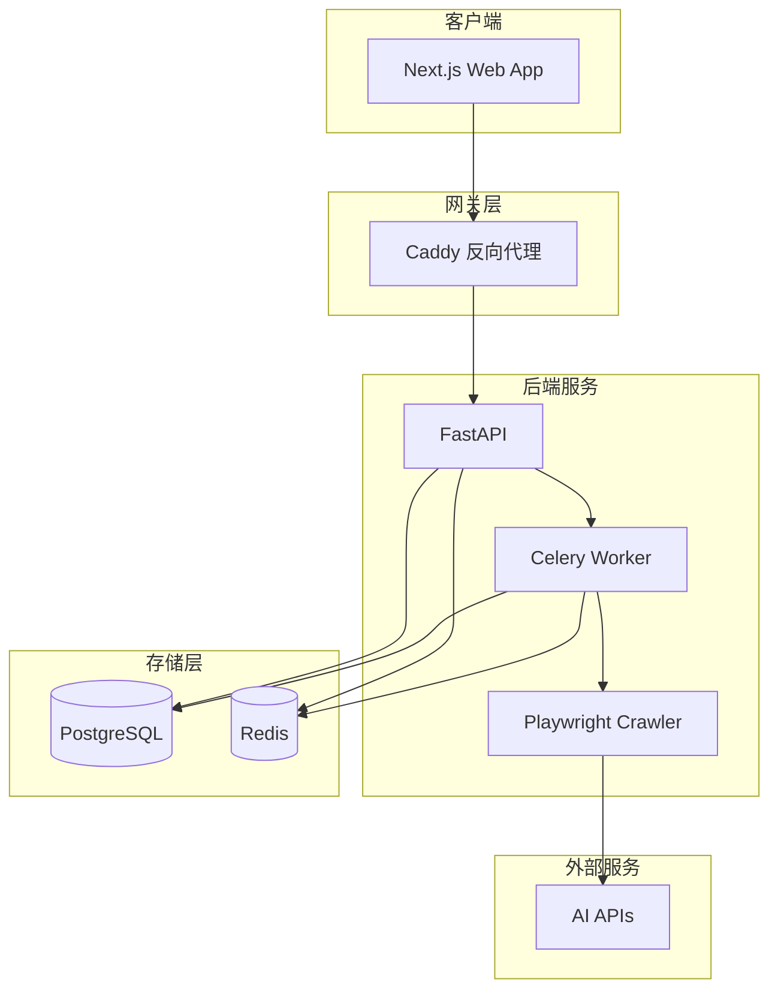

# FindableX - GEO 体检型 SaaS + 科研实验平台

垂直行业 GEO（Generative Engine Optimization）体检型 SaaS 平台，支持科研实验功能。

## 🎯 产品定位

- **体检型 SaaS**: 用户注册 → 导入/调用引擎输出 → 体检报告 → 分享/导出 → 订阅复测与预警
- **科研实验线**: 对照实验设计 → 时间序列漂移分析 → 数据集导出

---

## 📊 市场痛点

随着 AI 搜索引擎的兴起，品牌面临全新的可见性挑战：



### 痛点详解

| 痛点 | 描述 | 影响 |
|------|------|------|
| **AI 取代搜索** | ChatGPT、Perplexity 等直接生成答案 | 用户不再点击传统搜索结果 |
| **可见性盲区** | 品牌不知道是否被 AI 引用 | 无法评估营销效果 |
| **竞争失察** | 不了解竞品在 AI 中的表现 | 无法制定差异化策略 |
| **优化无据** | 没有数据支撑优化决策 | 资源浪费、效果不佳 |

---

## 🚀 用户旅程

```mermaid
flowchart LR
    subgraph onboard [注册引导]
        A1[访问官网] --> A2[注册账号]
        A2 --> A3[邮箱验证]
        A3 --> A4[自动创建工作区]
    end

    subgraph project [项目创建]
        B1[新建项目] --> B2[设置目标域名]
        B2 --> B3[选择行业模板]
        B3 --> B4[项目创建成功]
    end

    subgraph import [数据导入]
        C1[选择导入方式]
        C1 --> C2a[上传CSV/JSON]
        C1 --> C2b[粘贴文本]
        C1 --> C2c[API调用]
        C2a --> C3[数据解析]
        C2b --> C3
        C2c --> C3
    end

    subgraph analysis [分析处理]
        D1[提取引用] --> D2[识别品牌]
        D2 --> D3[计算指标]
        D3 --> D4[生成报告]
    end

    subgraph result [结果输出]
        E1[查看健康度评分]
        E2[分析竞品占比]
        E3[获取优化建议]
        E4[导出/分享报告]
    end

    subgraph monitor [持续监测]
        F1[定期复测] --> F2[检测变化]
        F2 --> F3{可见性下降?}
        F3 -->|是| F4[发送预警]
        F3 -->|否| F1
    end

    A4 --> B1
    B4 --> C1
    C3 --> D1
    D4 --> E1
    E1 --> E2 --> E3 --> E4
    E4 --> F1
```



### 旅程阶段说明



---

## 🏗️ 系统架构



---

## 🛠️ 技术栈

| 层级 | 技术 |
|------|------|
| 前端 | Next.js 14 (App Router), React, TailwindCSS |
| 后端 | FastAPI (Python 3.11+), Pydantic v2 |
| 数据库 | PostgreSQL 16, Redis 7 |
| 任务队列 | Celery 5 + Redis |
| AI/Agent | CrewAI, LangChain, Qwen API |
| 爬虫 | Playwright, 人类行为模拟 |
| 部署 | Docker Compose, Caddy |

---

## 📁 项目结构

```
findablex/
├── packages/
│   ├── api/          # FastAPI 后端
│   ├── worker/       # Celery 异步任务
│   ├── crawler/      # 浏览器自动化采集
│   ├── web/          # Next.js 前端
│   └── shared/       # 共享类型和工具
├── infra/            # 基础设施配置
│   ├── docker-compose.yml
│   ├── docker-compose.prod.yml
│   ├── caddy/
│   ├── postgres/
│   └── scripts/
├── docker/           # Dockerfile 集合
└── docs/             # 文档
```

---

## 🚀 快速开始

### 前置要求

- Docker & Docker Compose
- Node.js 18+ (本地开发)
- Python 3.11+ (本地开发)

### 开发环境启动

```bash
# 1. 克隆项目
git clone <repo-url> findablex
cd findablex

# 2. 复制环境变量
cp .env.example .env

# 3. 启动所有服务
make up

# 4. 运行数据库迁移
make migrate

# 5. 填充测试数据
make seed
```

### 访问服务

- **前端**: http://localhost:3000
- **API**: http://localhost:8000
- **API 文档**: http://localhost:8000/docs
- **Flower (任务监控)**: http://localhost:5555 (需要 `make up-monitoring`)

---

## 📋 常用命令

```bash
# 开发
make up              # 启动所有服务
make down            # 停止所有服务
make logs            # 查看日志
make logs-api        # 查看 API 日志
make shell-api       # 进入 API 容器

# 数据库
make migrate         # 执行迁移
make migrate-new     # 创建新迁移
make seed            # 填充测试数据
make backup          # 备份数据库
make restore FILE=x  # 恢复数据库

# 测试
make test            # 运行所有测试
make lint            # 代码检查

# 生产
make build           # 构建镜像
make deploy          # 部署到生产
```

---

## 📈 核心指标

FindableX 计算以下 GEO 核心指标：

| 指标 | 说明 |
|------|------|
| **可见性覆盖率** | 品牌被引用的查询占总查询的比例 |
| **平均引用位置** | 品牌在引用列表中的平均排名 |
| **Top3 出现率** | 品牌出现在前三个引用的比例 |
| **健康度评分** | 综合各项指标的整体健康度(0-100) |
| **竞品占比** | 竞争对手被引用的相对比例 |

---

## 🔐 安全说明

- 平台不主动爬取任何第三方网站
- 自动采集功能仅供授权研究员使用
- 优先使用官方 API（如 Qwen API）
- 用户导入数据由用户对来源负责
- 数据传输采用 TLS 加密
- 敏感数据存储采用 AES-256 加密

---

## 📄 License

MIT License
